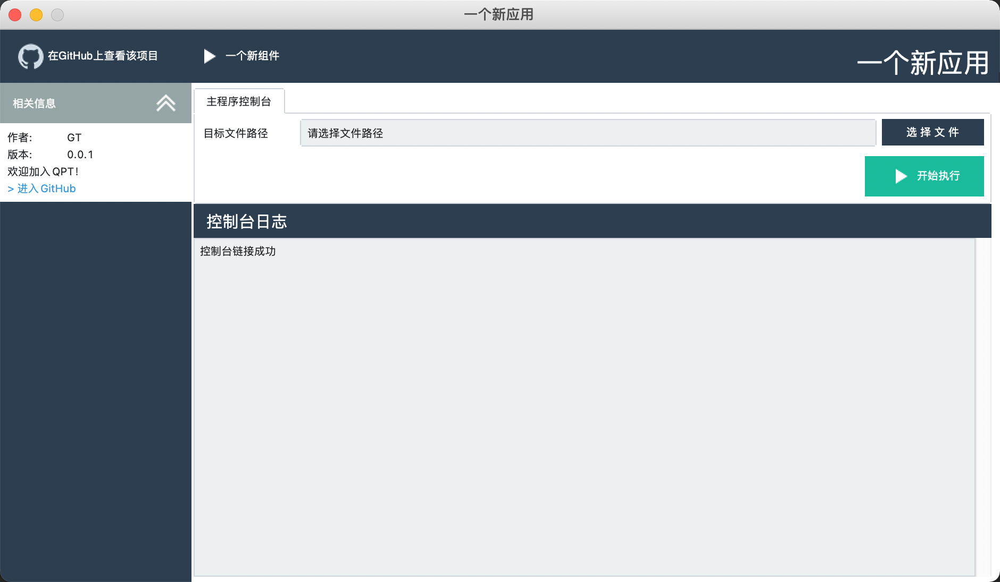
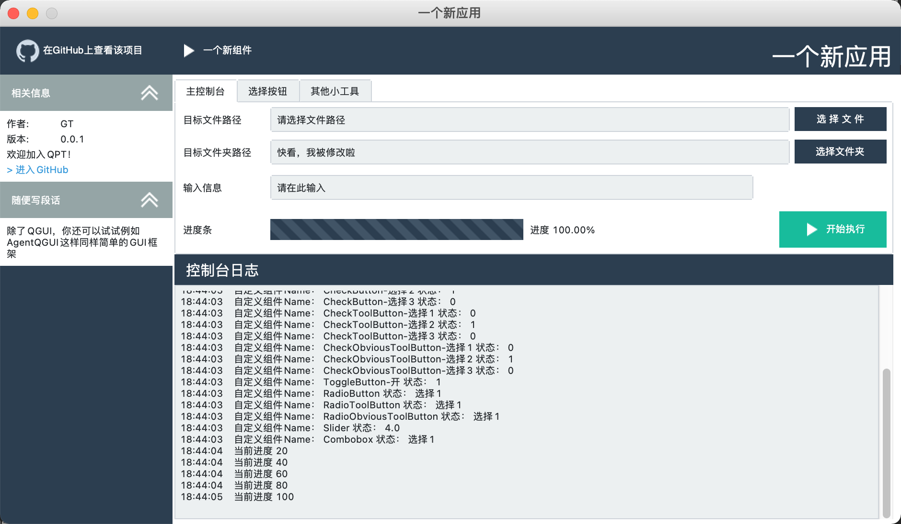
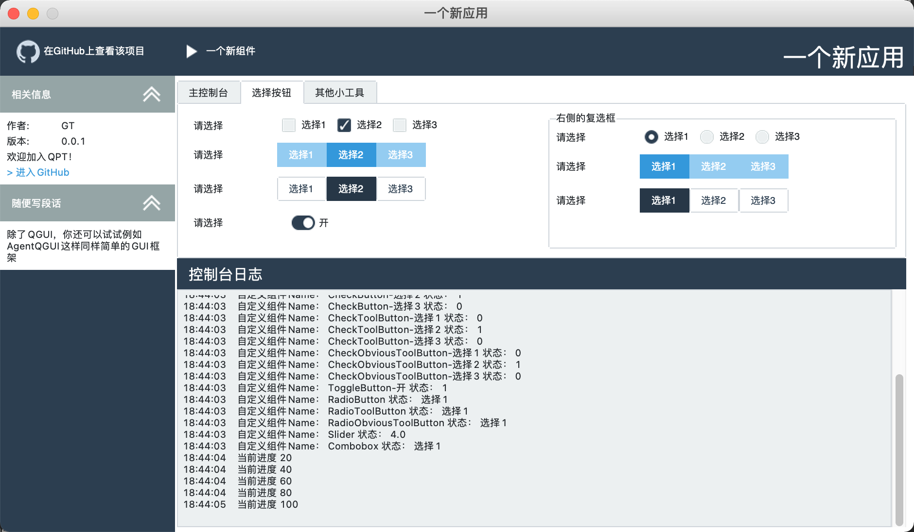
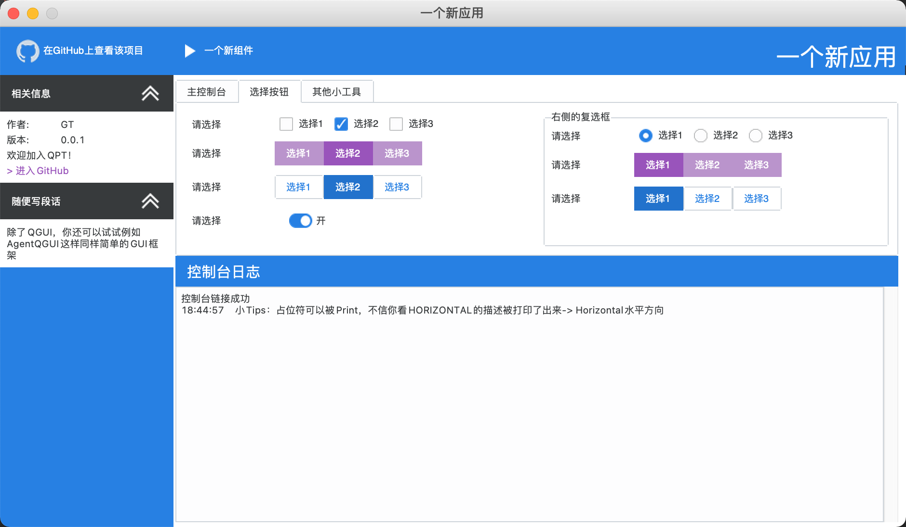

# QGUI

[](https://pepy.tech/project/qgui)


  
QGUI - 低于100k的超轻量桌面级图形化框架，可通过几行代码、使用模板来快捷制作出属于你的图形化界面

## EAP - Easy access program

> 当前版本为概念版本，仅确定QGUI架构使用，其中大部分功能不完善，如有需求可在issue中提出。

**版本规划**  
- [ ] 9月完成 V1.0预览版 - 提供常规GUI组件以及Callback
- [ ] 10月完成 V1.0正式版 - 完善预览版，提供窗口拓展组件
- [ ] 11月完成 V1.1 - 优化GUI排版，增加皮肤
- [ ] 12月完成 V1.2 - 适配更多深度学习输入格式
- [ ] 2022 - 支持远程模式

## 快速上手

### 安装QGUI

* 通用方式 ```python -m pip install qgui```
* 国内推荐 ```python -m pip install qgui -i https://mirrors.bfsu.edu.cn/pypi/web/simple```

### 代码示例/模板
- [x] [以PaddleHub为例的完整示例](./qgui/template/paddlehub_demo.py)  

简单示例

```python
from qgui import CreateQGUI
from qgui.bar_tools import BaseBarTool, GitHub
from qgui.notebook_tools import ChooseFileTextButton, RunButton


def click(args):
    print("你点到我啦~")
    print("输入框文字为：", args["文件选择"].get())


# 创建主界面
main_gui = CreateQGUI(title="一个新应用")

# 在界面最上方添加一个按钮，链接到GitHub主页
main_gui.add_banner_tool(GitHub("https://github.com/QPT-Family/QGUI"))
# 要不试试自定义Banner按钮？
main_gui.add_banner_tool(BaseBarTool(click, name="一个新组件"))
# 在主界面部分添加一个文件选择工具吧~
main_gui.add_notebook_tool(ChooseFileTextButton(name="文件选择"))
# 要不要再添加一个运行按钮？，绑定刚刚创建的函数吧~
main_gui.add_notebook_tool(RunButton(click))
# 简单加个简介
main_gui.set_navigation_about(author="GT",
                              version="0.0.1",
                              github_url="https://github.com/QPT-Family/QGUI",
                              other_info=["欢迎加入QPT！"])
# 跑起来~
main_gui.run()
```


### 组件文档

目前组件还在慢慢完善，随后就提供目录啦，可以先康一下[完整案例](qgui/template/full_case.py)  


进阶教程和完整组件文档暂时还没有，先委屈一下看看源码吧~  
[上方Banner工具](./qgui/bar_tools.py)  
左侧Navigation工具：`main_gui.set_navigation_about()` and `main_gui.set_navigation_info()`  
[中央Notebook工具](./qgui/notebook_tools.py)

